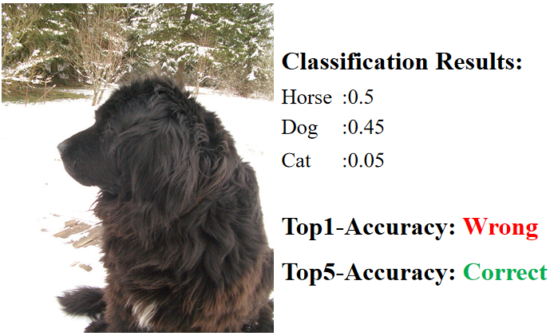

# 图像分类任务
为了制定图像分类任务数据集描述文件的模板，我们对主流的分类任务数据集进行了调研，分析其任务的目的和常见标注信息所包含的字段，从中整理出通用共享和独立字段，并在此基础上制定分类任务数据集描述文件的通用模板。
# 1. 任务调研

## 1.1 任务定义

图像分类是指给定一张输入图像，输出其语义类别。


## 1.2 评价指标

任务的评价指标一般有两个：top-5的准确率和top-1的准确率，准确率=（正确分类图片个数）/（所有图片个数）。top-5准确率指的是前5个得分最高的预测类别里有一个是正确的，就算这个样本被正确分类了，而top-1准确率计算时必须要满足预测分数最高的预测类别是正确的，才算这个样本被正确分类了。



## 1.3 主流数据集调研
我们调研了10个主流分类数据集，其中包含了ImageNet-1K、MNIST、CIFAR10等常见数据集。为了使得模板更加通用，同时也具备拓展能力，我们着重关注各个数据集之间的共性和特性，此外，调研过程会遇到一些名称不同，但是实际含义相同或类似的字段，这些字段我们也视为同一字段，并统一去命名，比如image_id字段一般表示图片的路径或者id，他是图片的唯一标识；label_id则表示图片的类别，可以用数字表示，也可以用字符串表示。完整的字段调研结果如下表所示：
  <table border="4" >
    <tr>
      <th rowspan="2" align=center colspan="1" align=center>图像分类数据集</th>
      <th colspan="2" align=center>共享字段</th>
      <th colspan="2" align=center>独立字段</th>
    </tr>
    <tr>
      <th>image_id</th>
      <th>label_id</th>
      <th>superclass</th>
    </tr>
    <tr>
      <th width="25%" >ImageNet-21K</th>
      <td width="20%" align="center">Y</td>
      <td width="20%" align="center">Y</td>
      <td width="20%" align="center">Y</td>
    </tr>
    <tr>
      <th width="25%" >ImageNet-1K</th>
      <td width="20%" align="center">Y</td>
      <td width="20%" align="center">Y</td>
      <td width="20%" align="center">Y</td>
    </tr>
    <tr>
      <th width="25%" >CIFAR10</th>
      <td width="20%" align="center">Y</td>
      <td width="20%" align="center">Y</td>
      <td width="20%" align="center"></td>
    </tr>
    <tr>
      <th width="25%" >CIFAR100</th>
      <td width="20%" align="center">Y</td>
      <td width="20%" align="center">Y</td>
      <td width="20%" align="center">Y</td>
    </tr>
    <tr>
      <th width="25%" >MNIST</th>
      <td width="20%" align="center">Y</td>
      <td width="20%" align="center">Y</td>
      <td width="20%" align="center"></td>
    </tr>
    <tr>
      <th width="25%" >Fashion-MNIST</th>
      <td width="20%" align="center">Y</td>
      <td width="20%" align="center">Y</td>
      <td width="20%" align="center"></td>
    </tr>
    <tr>
      <th width="25%" >Caltech-256</th>
      <td width="20%" align="center">Y</td>
      <td width="20%" align="center">Y</td>
      <td width="20%" align="center"></td>
    </tr>
    <tr>
      <th width="25%" >Oxford Flowers-102</th>
      <td width="20%" align="center">Y</td>
      <td width="20%" align="center">Y</td>
      <td width="20%" align="center"></td>
    </tr>
  </table>

经过整理，分类任务的共享字段和独立字段如下表所示：
<table border="4" >
    <tr>
      <th align=center >字段类型</th>
      <th align=center >字段名称</th>
      <th align=center >含义</th>
    </tr>
    <tr>
      <th rowspan="2">共享字段</th>
      <th>image_id</th>
      <td>定位到唯一图片，比如用图片名或者图片路径表示</td>
    <tr>
      <th>label_id</th>
      <td>图片所属的类别，类型为int表示为单标签，类型为List[int]表示多标签</td>
    <tr>
      <th rowspan="1">独立字段</th>
      <th>superclass</th>
      <td>图片所属类别的父类别，比如"dog"的父类可能是"animal"</td>
    </tr>
</table>
可以看到，如果要描述一个分类数据集的样本，image_id和label_id是最基础的字段，同时，也会有类似superclass的特有字段。  

<a id="table-2"></a>

# 2. 模板展示

根据上述的[调研结果](#table-1)，我们知道对于分类任务，一个样本最重要的属性是图片的id(或路径)以及图片的类别，因此我们在分类任务结构体（结构体的概念请参考[DSDL入门文档-语言定义-结构体](https://opendatalab.github.io/dsdl-docs/zh/lang/structs/#24)部分）的fields 属性中定义了image和label两个字段；其次，不同的数据集所蕴含的类别是各不相同的，所以在sample中需要有一个形参，来对类别域进行限定（在dsdl中，我们将类别域描述为class domain，或者cdom，具体可以参考[DSDL入门文档-语言定义-类别域](https://opendatalab.github.io/dsdl-docs/zh/lang/basic_types/#223-label)中更详细的定义）；最后，我们考虑到对于一些无监督或半监督分类任务，可能部分样本不包含类别信息，所以我们设计了$optional字段，并将label字段涵盖进去，同时一些数据集特有的字段也可以包含到$optional字段当中。基于上述考虑，我们制定了分类任务的模板，如下所示：
```yaml
$dsdl-version: "0.5.0"

ClassificationSample:
    $def: struct
    $params: ['cdom']
    $fields:
        image: Image
        label: Label[dom=$cdom]
    $optional: ['label']
```
在模板中的一些字段的含义如下所示：

  - $dsdl-version: 描述了该文件对应的dsdl版本
  - ClassificationSample: 定义了分类任务的样本格式，其包含了四个属性：

    - $def: 表示ClassificationSample是一个struct(结构体类)
    - $params: 定义了形参，在这里即class domain
    - $fields: 结构体类所包含的属性，对于分类任务，具体包括:

      - image 图片路径
      - label 类别信息
      
    - $optional: 用来涵盖结构体类的属性中的可选属性，这里只定义了一个字段即label，表示单个样本，label的存在是可选的，另外也可以将数据集的特有字段涵盖在$optional字段里

对于模板中提到的类别域cdom，我们在模板库[dsdl-sdk repo](https://gitlab.shlab.tech/research/dataset_standard/dsdl-sdk/-/tree/feature-types/dsdl/dsdl_library)中也提供了常见任务的类别域，这里给出cifar10数据集的class domain作为示例：
```yaml
$dsdl-version: "0.5.0"

Cifar10ImageClassificationClassDom:
    $def: class_domain
    classes:
        - airplane
        - automobile
        - bird
        - cat
        - deer
        - dog
        - frog
        - horse
        - ship
        - truck
```  
上面的文件中给出了Cifar10ImageClassificationClassDom的定义，具体包含下列字段：

- $def: 描述了Cifar10ImageClassificationClassDom的类型，这里即class_domain
- classes: 描述了该类别域中所包含的类别及其顺序，在cifar10数据集中，则依次为airplane、automobile等等

这一章节介绍的分类任务模板和cdom模板都可以在我们的模板库[dsdl-sdk repo](https://gitlab.shlab.tech/research/dataset_standard/dsdl-sdk/-/tree/feature-types/dsdl/dsdl_library)中找到，其他任务类型和类别域的模板也欢迎大家尝试使用。

# 3. 使用说明

在这个章节介绍一下如何通过import的方式来引用我们的模板。以cifar10数据集为例，首先是描述cifar10数据集中所有样本的模板train.yaml，举例如下：

```yaml
$dsdl-version: "0.5.0"

$import:
    - ../defs/class-dom
    - ../defs/classification-cifar10

meta:
    name: "cifar10"
    subdata-name: "train"

data:
    sample-type: Cifar10Sample[cdom=Cifar10ImageClassificationClassDom]
    sample-path: $local
    samples:
      - image: "images/000000000000.png"
        label: frog
      - image: "images/000000000001.png"
        label: truck
        ...
```

上面的描述文件中，首先定义了dsdl的版本信息，然后import了两个模板文件，包括任务模板和类别域模板，接着用meta和data字段来描述自己的数据集，具体的字段说明如下所示：  

- $dsdl-version: dsdl版本信息
- $import: 模板导入信息，这里导入分类任务模板和cifar10的class domain，也就是章节[2. 模板展示](#table-2)中展示的两部分内容
- meta: 主要展示数据集的一些元信息，比如数据集名称，创建者等等，用户可以自己添加想要备注的其它信息
- data: data的内容就是按照前面定义好的结构所保存的样本信息，具体如下：  

    - sample-type: 数据的类型定义，在这里用的是从分类任务模板中导入的ClassificationSample类，同时指定了采用的cdom为Cifar10ImageClassificationClassDom
    - sample-path: samples的存放路径，如果实际是一个路径，则samples的内容从该文件读取，如果是$local（这个例子），则从本文件的data.samples字段中直接读取
    - samples: 保存数据集的样本信息，注意只有在sample-path是$local的时候该字段才会生效，否则samples会优先从sample-path中的路径去读取
